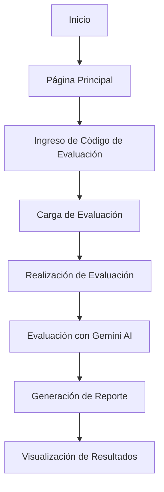
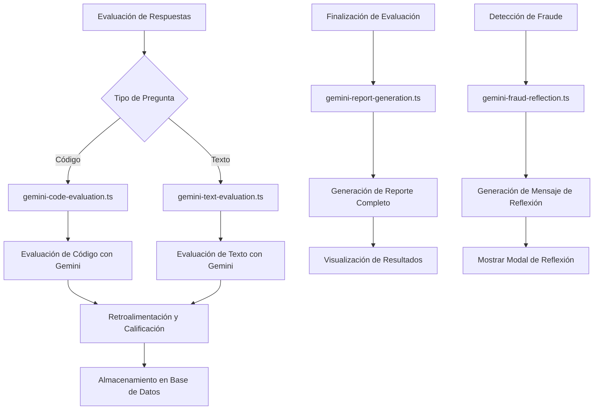
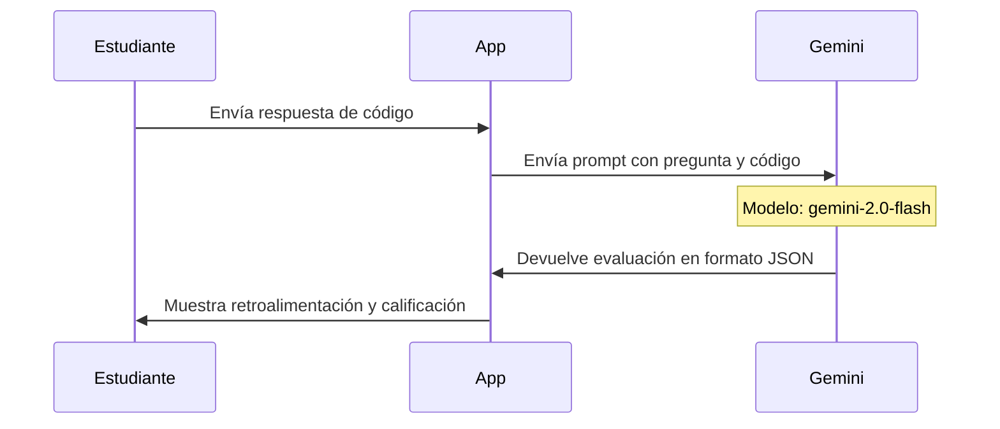
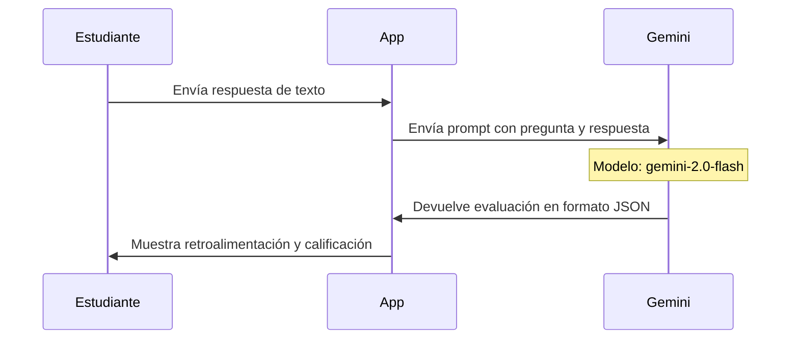
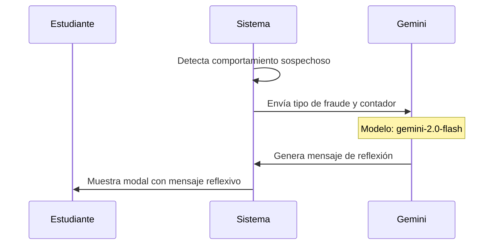
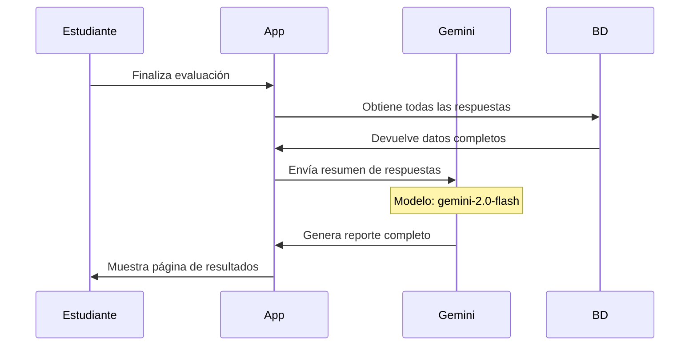

# Diagrama de Flujo: Sistema de Evaluación Inteligente Académica (SEIA)

Este documento presenta un diagrama de flujo detallado del funcionamiento de la aplicación SEIA, centrándose principalmente en la integración y uso de Google Gemini para la evaluación automática y generación de reportes.

## Arquitectura General del Sistema

## Componentes Principales

### 1. Interfaz de Usuario
- **Página Principal**: Punto de entrada a la aplicación
- **Página de Ingreso**: Donde el estudiante introduce su código único
- **Página de Evaluación**: Interfaz para responder preguntas
- **Página de Resultados**: Muestra el reporte generado por Gemini

### 2. Integración con Gemini AI

## Flujo Detallado de la Integración con Gemini

### 1. Evaluación de Código (gemini-code-evaluation.ts)

**Proceso:**
1. El estudiante escribe código en el editor Monaco
2. Al hacer clic en "Evaluar", se envía la pregunta y el código a Gemini
3. Se utiliza un prompt específico que instruye a Gemini a actuar como evaluador
4. Gemini analiza el código y devuelve un JSON con:
   - `isCorrect`: Indica si la respuesta es correcta
   - `feedback`: Retroalimentación constructiva
   - `grade`: Calificación de 0.0 a 5.0
5. La aplicación muestra los resultados al estudiante

### 2. Evaluación de Texto (gemini-text-evaluation.ts)

**Proceso:**
1. El estudiante escribe su respuesta en un área de texto
2. Al hacer clic en "Evaluar", se envía la pregunta y la respuesta a Gemini
3. Se utiliza un prompt específico para evaluación de texto
4. Gemini analiza la respuesta y devuelve un JSON similar al de código
5. La aplicación muestra los resultados al estudiante

### 3. Detección de Fraude (gemini-fraud-reflection.ts)

**Proceso:**
1. El sistema detecta comportamientos sospechosos como:
   - Cambio de pestaña
   - Pérdida de foco de ventana
   - Uso de teclas sospechosas
   - Intento de copiar/pegar
   - Intento de imprimir
2. Se envía el tipo de fraude y el contador a Gemini
3. Gemini genera un mensaje reflexivo único
4. El sistema muestra un modal con el mensaje al estudiante

### 4. Generación de Reporte (gemini-report-generation.ts)

**Proceso:**
1. El estudiante finaliza la evaluación
2. La aplicación recopila todas las respuestas y calificaciones
3. Se envía a Gemini:
   - Nombre del estudiante
   - Título de la evaluación
   - Resumen de respuestas y calificaciones
   - Calificación promedio
   - Número de intentos de fraude
4. Gemini genera un reporte completo en formato JSON con:
   - `overallFeedback`: Retroalimentación general
   - `strengths`: Lista de fortalezas identificadas
   - `areasForImprovement`: Áreas que necesitan mejora
   - `grade`: Calificación final
   - `congratulationMessage`: Mensaje de felicitación (si aplica)
   - `recommendationMessage`: Recomendaciones (si aplica)
5. La aplicación muestra el reporte en la página de resultados

## Tecnologías Utilizadas

- **Frontend**: Next.js, React, TailwindCSS
- **IA**: Google Gemini API (@google/genai)
- **Base de Datos**: Prisma ORM con base de datos relacional
- **Editor de Código**: Monaco Editor para preguntas de programación
- **Markdown**: Editor MD para preguntas de texto enriquecido

## Características de Seguridad

La aplicación implementa varias medidas para garantizar la integridad académica:

1. **Detección de Fraude**:
   - Monitoreo de cambios de pestaña/ventana
   - Detección de teclas sospechosas
   - Prevención de copiar/pegar
   - Registro de tiempo fuera de la evaluación

2. **Mensajes Reflexivos**:
   - Generados por Gemini para cada tipo de comportamiento sospechoso
   - Adaptados según la frecuencia de los intentos
   - Enfocados en la reflexión y no en la acusación

## Conclusión

El Sistema de Evaluación Inteligente Académica (SEIA) utiliza la API de Google Gemini de manera integral para proporcionar una experiencia de evaluación automatizada, personalizada y con retroalimentación inmediata. La integración de Gemini permite:

1. Evaluación objetiva de respuestas de código y texto
2. Generación de retroalimentación constructiva y personalizada
3. Creación de mensajes reflexivos ante comportamientos sospechosos
4. Elaboración de reportes detallados al finalizar la evaluación

Esta arquitectura permite a los estudiantes recibir retroalimentación inmediata y a los profesores obtener análisis detallados del desempeño de sus estudiantes, todo ello aprovechando el poder de la inteligencia artificial generativa.