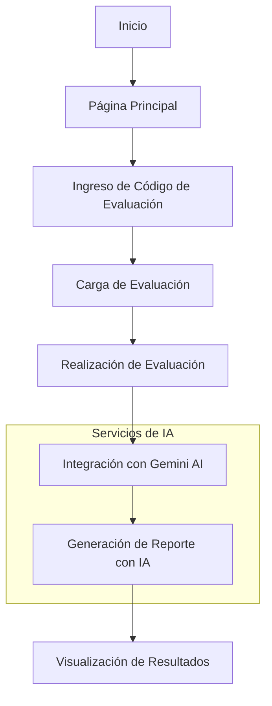
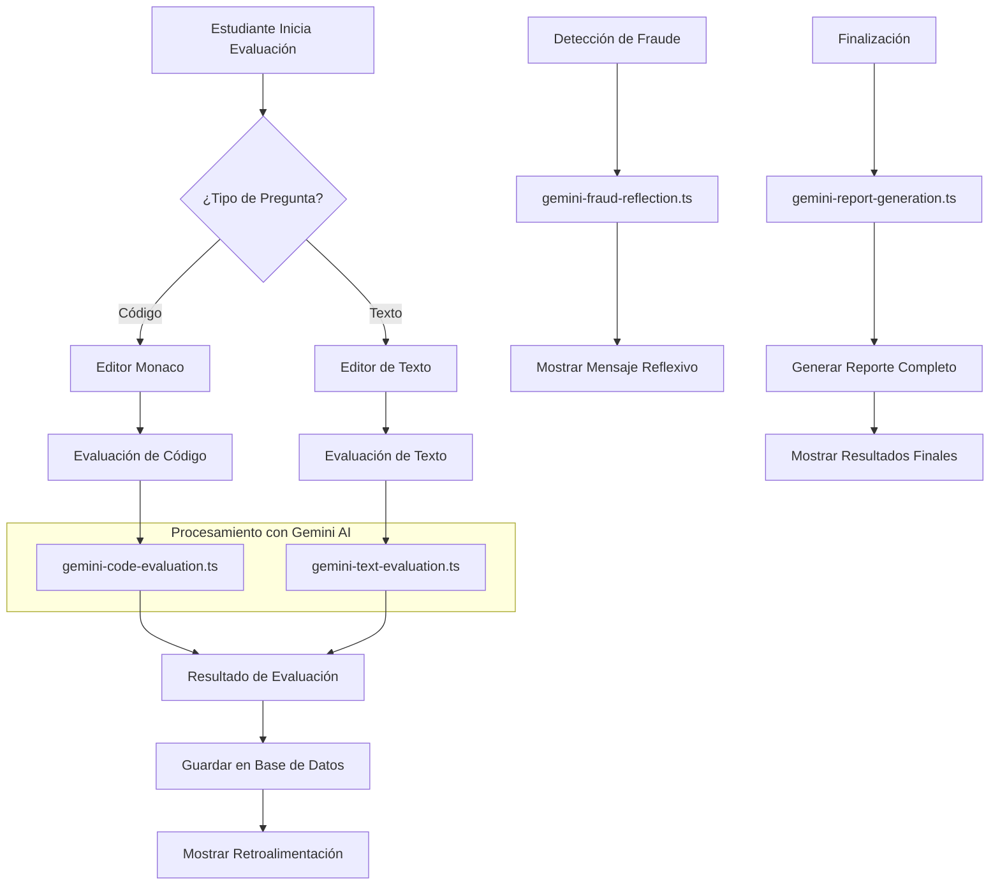
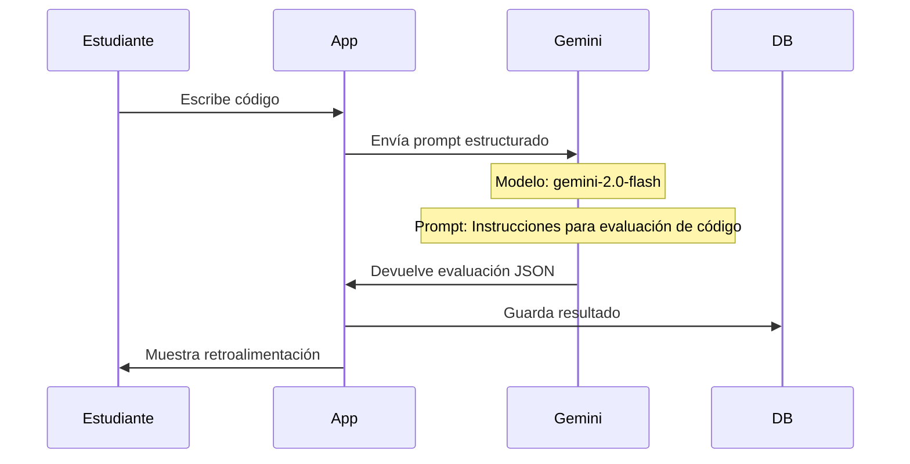
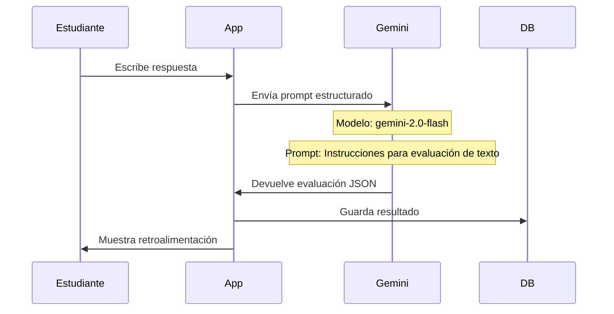
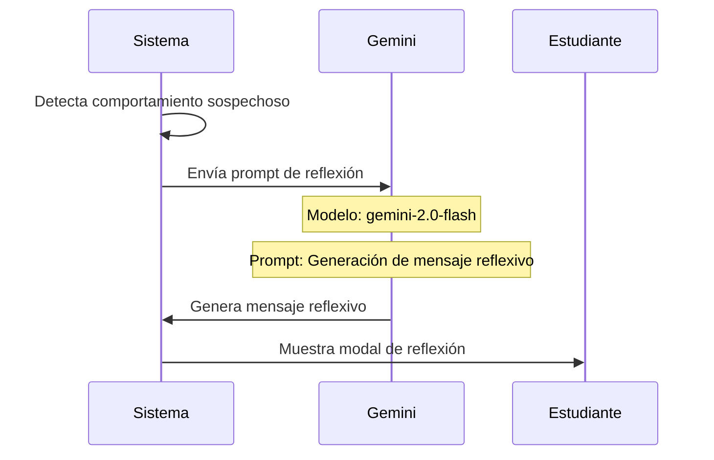
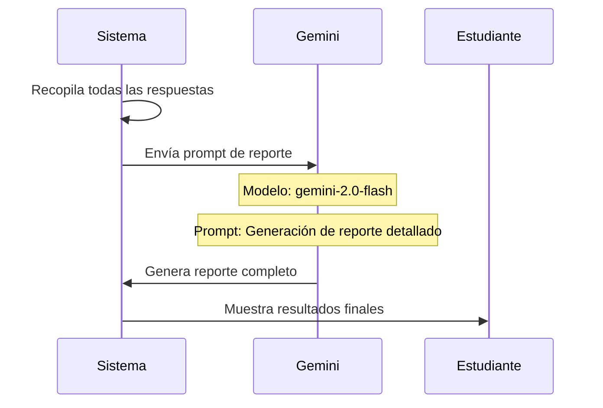

# Diagrama de Flujo: Sistema de Evaluación Inteligente Académica (SEIA)

## Arquitectura General del Sistema con IA



## Flujo Detallado de Evaluación con IA



## Proceso de Evaluación con Gemini AI

### 1. Evaluación de Código


### 2. Evaluación de Texto


### 3. Detección de Fraude con IA


### 4. Generación de Reporte Final con IA


## Prompts de IA Utilizados

### 1. Evaluación de Código
```typescript
const prompt = `
Eres un evaluador de código para estudiantes. Evalúa el siguiente código basado en la pregunta proporcionada.

PREGUNTA:
${questionText}

CÓDIGO DEL ESTUDIANTE (${language}):
${studentCode}

Evalúa si el código responde correctamente a la pregunta. Proporciona retroalimentación constructiva y asigna una nota de 0.0 a 5.0 según la calidad de la respuesta. No des la respuesta completa, solo pistas o sugerencias si hay errores. Si está correcto, felicita al estudiante.

Responde ÚNICAMENTE en formato JSON con la siguiente estructura:
{
  "isCorrect": boolean, // true si la respuesta es correcta, false si no lo es
  "feedback": string // retroalimentación constructiva, pistas o felicitación
  "grade": number // nota de 0.0 a 5.0
}
`;
```

#### Análisis del Prompt de Evaluación de Código

**Rol:**
- Evaluador de código para estudiantes
- Experto en el lenguaje de programación específico

**Tarea:**
- Evaluar código de estudiantes
- Proporcionar retroalimentación constructiva
- Asignar calificación numérica

**Instrucciones (CoT):**
1. Analizar la pregunta proporcionada
2. Examinar el código del estudiante en el lenguaje específico
3. Determinar si el código responde correctamente
4. Generar retroalimentación constructiva
5. Asignar una calificación de 0.0 a 5.0
6. Formatear la respuesta en JSON

**Instrucciones Condicionales:**
- Si el código es correcto:
  - Felicitar al estudiante
  - Proporcionar retroalimentación positiva
- Si el código tiene errores:
  - No dar la solución completa
  - Proporcionar pistas o sugerencias
  - Explicar los errores de manera constructiva

### 2. Evaluación de Texto
```typescript
const prompt = `
Eres un evaluador de respuestas de texto para estudiantes. Evalúa la siguiente respuesta basada en la pregunta proporcionada.

PREGUNTA:
${questionText}

RESPUESTA DEL ESTUDIANTE:
${studentAnswer}

Evalúa si la respuesta responde correctamente a la pregunta. Proporciona retroalimentación constructiva y asigna una nota de 0.0 a 5.0 según la calidad de la respuesta. No des la respuesta completa, solo pistas o sugerencias si hay errores. Si está correcto, felicita al estudiante.

Responde ÚNICAMENTE en formato JSON con la siguiente estructura:
{
  "isCorrect": boolean, // true si la respuesta es correcta o aceptable, false si no lo es
  "feedback": string // retroalimentación constructiva, sugerencias o felicitación
  "grade": number // nota de 0.0 a 5.0
}
`;
```

#### Análisis del Prompt de Evaluación de Texto

**Rol:**
- Evaluador de respuestas de texto
- Experto en el tema de la pregunta

**Tarea:**
- Evaluar respuestas textuales
- Proporcionar retroalimentación constructiva
- Asignar calificación numérica

**Instrucciones (CoT):**
1. Analizar la pregunta proporcionada
2. Examinar la respuesta del estudiante
3. Evaluar la precisión y completitud
4. Generar retroalimentación constructiva
5. Asignar una calificación de 0.0 a 5.0
6. Formatear la respuesta en JSON

**Instrucciones Condicionales:**
- Si la respuesta es correcta:
  - Felicitar al estudiante
  - Proporcionar retroalimentación positiva
- Si la respuesta es incorrecta:
  - No dar la respuesta completa
  - Proporcionar pistas o sugerencias
  - Explicar los errores de manera constructiva

### 3. Mensajes de Reflexión
```typescript
const prompt = `
Eres un asistente educativo que promueve la integridad académica. Genera un mensaje reflexivo único y profundo para un estudiante que ha realizado una acción que podría considerarse un intento de fraude durante una evaluación en línea.

TIPO DE ACCIÓN DETECTADA:
${fraudType}

NÚMERO DE INTENTOS DETECTADOS:
${fraudCount}

NIVEL DE SEVERIDAD:
${severityLevel}

INSTRUCCIONES ESPECÍFICAS:
- Genera un mensaje reflexivo ÚNICO y DIFERENTE cada vez, evitando frases genéricas o repetitivas
- Incluye una frase filosófica o cita inspiradora sobre la integridad, el conocimiento o la ética
- Adapta el tono según el nivel de severidad (bajo: educativo, medio: reflexivo, alto: serio pero constructivo)
- El mensaje debe invitar a la introspección sobre el valor real del aprendizaje y el conocimiento
- Evita un tono acusatorio, enfócate en el crecimiento personal y los valores académicos

Responde ÚNICAMENTE en formato JSON con la siguiente estructura:
{
  "title": string, // Título breve para el modal (máximo 50 caracteres)
  "message": string, // Mensaje principal de reflexión (100-200 caracteres) - DEBE ser una frase reflexiva única
  "suggestion": string // Sugerencia constructiva (máximo 100 caracteres)
}
`;
```

#### Análisis del Prompt de Mensajes de Reflexión

**Rol:**
- Asistente educativo
- Promotor de integridad académica
- Guía reflexivo

**Tarea:**
- Generar mensajes reflexivos únicos
- Adaptar el tono según la severidad
- Promover la introspección

**Instrucciones (CoT):**
1. Analizar el tipo de acción detectada
2. Considerar el número de intentos
3. Determinar el nivel de severidad
4. Generar un mensaje único y reflexivo
5. Incluir una cita o frase filosófica
6. Adaptar el tono según la severidad
7. Formatear la respuesta en JSON

**Instrucciones Condicionales:**
- Para severidad baja:
  - Tono educativo
  - Enfoque en aprendizaje
- Para severidad media:
  - Tono reflexivo
  - Enfoque en valores
- Para severidad alta:
  - Tono serio pero constructivo
  - Enfoque en consecuencias

### 4. Generación de Reporte
```typescript
const prompt = `
Eres un asistente educativo que genera reportes detallados de evaluaciones académicas. 
Genera un reporte completo para el siguiente estudiante basado en sus respuestas y calificaciones.

ESTUDIANTE: ${studentName}
EVALUACIÓN: ${evaluationTitle}
CALIFICACIÓN PROMEDIO: ${averageScore.toFixed(1)}/5.0
INTENTOS DE FRAUDE DETECTADOS: ${fraudAttempts}

DETALLE DE RESPUESTAS:
${answersDetail}

Basado en esta información, genera un reporte completo que incluya:
1. Una retroalimentación general sobre el desempeño del estudiante
2. Las principales fortalezas demostradas
3. Áreas específicas que necesitan mejora
4. Un mensaje personalizado de felicitación si la calificación es buena (≥ 4.0) o recomendaciones constructivas si la calificación es baja (< 3.0)

Ten en cuenta los intentos de fraude en tu evaluación si los hubiera.

Responde ÚNICAMENTE en formato JSON con la siguiente estructura:
{
  "overallFeedback": string, // Retroalimentación general sobre el desempeño
  "strengths": string[], // Lista de fortalezas identificadas (al menos 2)
  "areasForImprovement": string[], // Lista de áreas que necesitan mejora (al menos 2)
  "grade": number, // La calificación final (debe ser igual a ${averageScore.toFixed(1)})
  "congratulationMessage": string, // Mensaje de felicitación (solo si la nota es ≥ 4.0)
  "recommendationMessage": string // Mensaje de recomendación (solo si la nota es < 3.0)
}
`;
```

#### Análisis del Prompt de Generación de Reporte

**Rol:**
- Asistente educativo
- Generador de reportes académicos
- Analista de desempeño

**Tarea:**
- Generar reportes detallados
- Analizar fortalezas y debilidades
- Proporcionar retroalimentación personalizada

**Instrucciones (CoT):**
1. Analizar los datos del estudiante
2. Revisar todas las respuestas
3. Calcular y verificar la calificación promedio
4. Identificar fortalezas principales
5. Identificar áreas de mejora
6. Generar mensajes personalizados
7. Formatear la respuesta en JSON

**Instrucciones Condicionales:**
- Si calificación ≥ 4.0:
  - Incluir mensaje de felicitación
  - Enfocarse en fortalezas
- Si calificación < 3.0:
  - Incluir mensaje de recomendación
  - Enfocarse en áreas de mejora
- Si hay intentos de fraude:
  - Considerar en la evaluación general
  - Incluir en las recomendaciones

## Componentes del Sistema

### 1. Frontend
- Next.js y React para la interfaz de usuario
- Monaco Editor para preguntas de código
- Editor Markdown para preguntas de texto
- TailwindCSS para estilos

### 2. Backend
- API Routes de Next.js
- Prisma ORM para base de datos
- Integración con Google Gemini API

### 3. Base de Datos
- PostgreSQL
- Modelos principales:
  - Evaluation
  - Question
  - Answer
  - Attempt

### 4. Servicios de IA
- gemini-code-evaluation.ts
- gemini-text-evaluation.ts
- gemini-fraud-reflection.ts
- gemini-report-generation.ts

## Características de Seguridad

1. **Detección de Fraude**
   - Monitoreo de cambios de pestaña/ventana
   - Detección de teclas sospechosas
   - Prevención de copiar/pegar
   - Registro de tiempo fuera de la evaluación

2. **Mensajes Reflexivos**
   - Generados por Gemini para cada tipo de comportamiento sospechoso
   - Adaptados según la frecuencia de los intentos
   - Enfocados en la reflexión y no en la acusación

## Flujo de Datos

1. **Entrada de Datos**
   - Código de evaluación único
   - Respuestas de texto o código
   - Comportamientos del estudiante

2. **Procesamiento con IA**
   - Evaluación con Gemini AI
   - Detección de fraude
   - Generación de reportes

3. **Salida de Datos**
   - Retroalimentación inmediata
   - Mensajes reflexivos
   - Reporte final detallado

## Tecnologías Utilizadas

- **Frontend**: Next.js, React, TailwindCSS
- **IA**: Google Gemini API (@google/genai)
- **Base de Datos**: Prisma ORM con PostgreSQL
- **Editor de Código**: Monaco Editor
- **Markdown**: Editor MD para texto enriquecido 