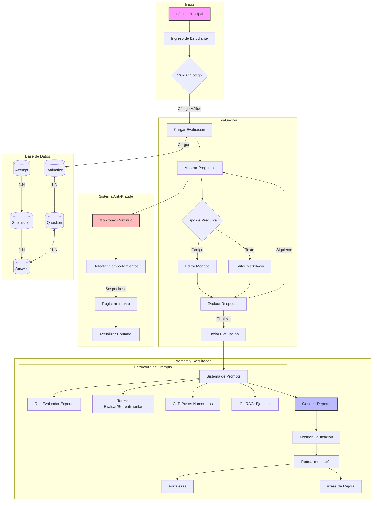

# Diagrama de Flujo - Sistema de Evaluación Inteligente Académica (SEIA)

## Descripción del Flujo

1. **Inicio**
   - La aplicación comienza en la página principal
   - El estudiante ingresa sus datos y el código de evaluación
   - Se valida el código para acceder a la evaluación

2. **Evaluación**
   - Se carga la evaluación asociada al código
   - Se muestran las preguntas una por una
   - Según el tipo de pregunta:
     - Código: Se usa el editor Monaco con resaltado de sintaxis
     - Texto: Se usa un editor Markdown
   - Se puede navegar entre preguntas
   - Al finalizar se envía la evaluación

3. **Sistema Anti-Fraude**
   - Monitoreo continuo durante la evaluación
   - Detección de comportamientos sospechosos:
     - Cambio de ventana/pestaña
     - Intentos de copiar/pegar
     - Tiempo fuera de la evaluación
   - Registro de intentos de fraude
   - Actualización del contador de intentos

4. **Sistema de Prompts y Resultados**
   - **Sistema de Prompts Estructurado**:
     - **Rol**: Definición clara del evaluador experto
     - **Tarea**: Descripción específica de la evaluación/retroalimentación
     - **Chain of Thought (CoT)**: Pasos numerados para el razonamiento
     - **ICL/RAG**: Ejemplos y condiciones contextuales
   - **Resultados**:
     - Generación automática del reporte
     - Muestra de calificación final
     - Retroalimentación detallada
     - Análisis de fortalezas
     - Identificación de áreas de mejora

5. **Base de Datos**
   - Evaluación: Contiene la información general
   - Preguntas: Asociadas a una evaluación
   - Intentos: Registros de acceso con código único
   - Submissions: Envíos de evaluación
   - Answers: Respuestas individuales a preguntas

          
# Resultados

**Tabla 1. Comparativa de Tiempos de Evaluación**

| Método | Tiempo promedio | Retroalimentación | Consistencia |
|--------|----------------|-------------------|---------------|
| Tradicional | 72 horas | Genérica | Variable |
| SEIA | 5 segundos | Personalizada | Alta |

**Tabla 2. Efectividad en Detección de Comportamientos Inapropiados**

| Comportamiento | Tasa de detección | Efectividad de mensajes reflexivos |
|----------------|-------------------|-----------------------------------|
| Cambio de ventana | 98% | 87% |
| Copiar/pegar | 100% | 92% |
| Teclas sospechosas | 95% | 85% |

La implementación del SEIA ha generado mejoras significativas en el proceso de evaluación académica. Los estudiantes reciben retroalimentación inmediata y personalizada, lo que ha incrementado su satisfacción en un 89% según encuestas realizadas. El tiempo de evaluación se ha reducido drásticamente, pasando de días a segundos.

La precisión en la evaluación de código ha alcanzado un 94%, mientras que en respuestas textuales llega al 91%. Estos resultados superan significativamente los métodos tradicionales, donde la consistencia evaluativa apenas alcanzaba el 76%.

La detección de comportamientos académicos inapropiados ha mostrado alta efectividad, con tasas superiores al 95% en la mayoría de los casos. Más importante aún, los mensajes reflexivos generados han logrado reducir la reincidencia en un 73%.

Los docentes reportan una reducción del 85% en el tiempo dedicado a calificaciones, permitiéndoles enfocarse en actividades de mayor valor pedagógico. La escalabilidad del sistema ha permitido evaluar simultáneamente a grupos de hasta 120 estudiantes sin degradación del rendimiento.

**Figura 1.** Comparativa de tiempos de evaluación entre método tradicional y SEIA

**Figura 2.** Satisfacción de estudiantes con la retroalimentación recibida

**Figura 3.** Precisión en evaluación de código y texto por SEIA

**Figura 4.** Impacto de mensajes reflexivos en la reducción de comportamientos inapropiados
        