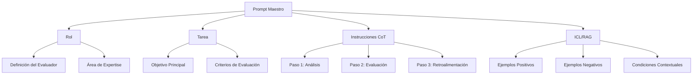

# Estructura de Prompts del Sistema

## 1. Estructura General



## 2. Componentes Detallados

### 2.1 Rol (Evaluador Experto)
- **Definición**: Evaluador experto en el área específica
- **Expertise**: Conocimiento profundo en:
  - Lenguajes de programación relevantes
  - Mejores prácticas de codificación
  - Pedagogía y evaluación educativa

### 2.2 Tarea (Evaluar/Retroalimentar)
- **Objetivo**: Evaluar respuestas y proporcionar retroalimentación constructiva
- **Criterios**:
  - Corrección técnica
  - Eficiencia del código/respuesta
  - Claridad y legibilidad
  - Seguimiento de mejores prácticas

### 2.3 Chain of Thought (CoT)
1. **Análisis Inicial**:
   - Comprender el contexto de la pregunta
   - Identificar conceptos clave
   - Revisar requisitos específicos

2. **Proceso de Evaluación**:
   - Verificar corrección técnica
   - Analizar eficiencia
   - Evaluar estilo y mejores prácticas
   - Detectar posibles problemas

3. **Generación de Retroalimentación**:
   - Identificar fortalezas
   - Señalar áreas de mejora
   - Proporcionar ejemplos constructivos
   - Sugerir recursos adicionales

### 2.4 ICL/RAG (Ejemplos y Contexto)

#### Ejemplos Positivos
```python
# Ejemplo de buena respuesta
def calculate_average(numbers):
    """
    Calcula el promedio de una lista de números.
    Args:
        numbers (list): Lista de números
    Returns:
        float: Promedio calculado
    """
    if not numbers:
        return 0
    return sum(numbers) / len(numbers)
```

#### Ejemplos Negativos
```python
# Ejemplo de respuesta a mejorar
def avg(n):
    s = 0
    for i in n:
        s = s + i
    return s/len(n)
```

#### Condiciones Contextuales
- **Nivel del Estudiante**: Adaptar retroalimentación según el nivel
- **Tipo de Pregunta**: Ajustar criterios según sea código o texto
- **Objetivos de Aprendizaje**: Alinear con los objetivos específicos
- **Tiempo Disponible**: Considerar restricciones temporales
